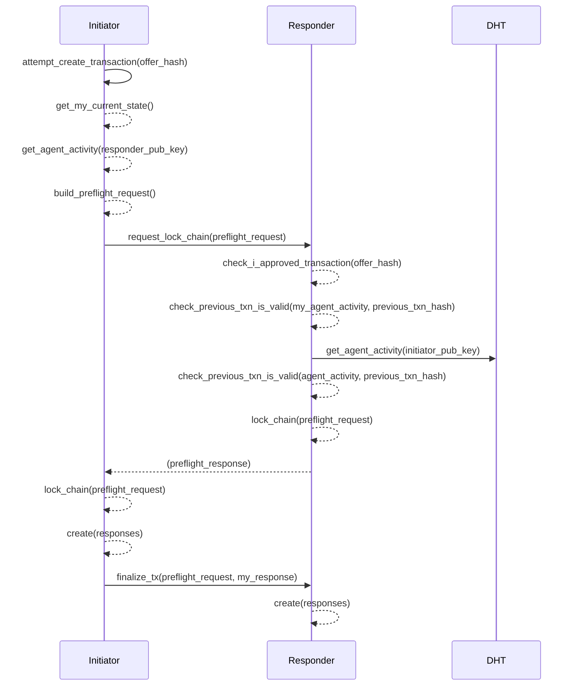

```mermaid

sequenceDiagram

Initiator->>Initiator: attempt_create_transaction(offer_hash)
Initiator-->>Initiator: get_my_current_state()
Initiator-->>Initiator: get_agent_activity(responder_pub_key)
Initiator-->>Initiator: build_preflight_request()
Initiator->>Responder: request_lock_chain(preflight_request)
Responder-->>Responder: check_i_approved_transaction(offer_hash)
Responder-->>Responder: check_previous_txn_is_valid(my_agent_activity, previous_txn_hash)
Responder->>DHT: get_agent_activity(initiator_pub_key)
Responder-->>Responder: check_previous_txn_is_valid(agent_activity, previous_txn_hash)
Responder-->>Responder: lock_chain(preflight_request)
Responder-->>Initiator: (preflight_response)
Initiator-->>Initiator: lock_chain(preflight_request)
Initiator-->>Initiator: create(responses)
Initiator->>Responder: finalize_tx(preflight_request, my_response)
Responder-->>Responder: create(responses)
```