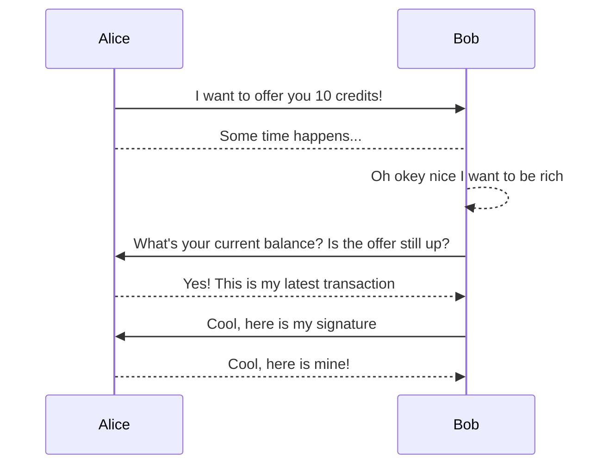
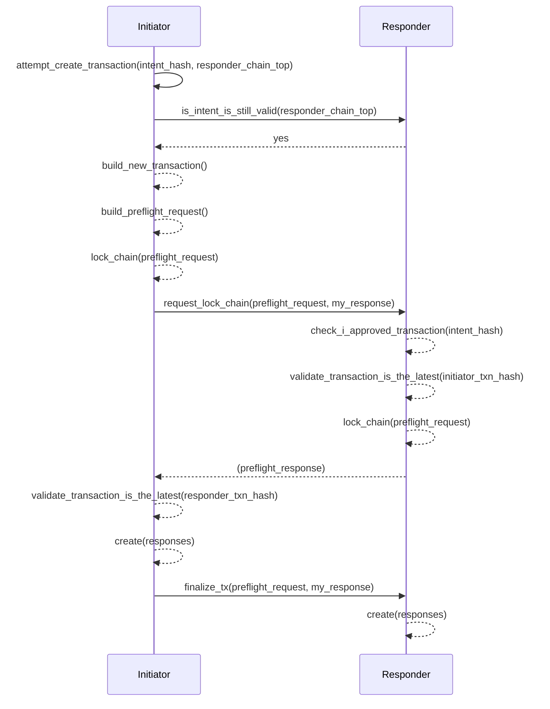

```mermaid

sequenceDiagram

Alice->>Bob: I want to offer you 10 credits!
Alice-->Bob: Some time happens...
Bob-->>Bob: Oh okey nice I want to be rich
Bob->>Alice: What's your current balance? Is the offer still up?
Alice-->>Bob: Yes! This is my latest transaction
Bob->>Alice: Cool, here is my signature
Alice-->>Bob: Cool, here is mine!
```

```mermaid

sequenceDiagram

Initiator->>Initiator: attempt_create_transaction(intent_hash, responder_chain_top)
Initiator->>Responder: is_intent_is_still_valid(responder_chain_top)
Responder-->>Initiator: yes
Initiator-->>Initiator: build_new_transaction()
Initiator-->>Initiator: build_preflight_request()
Initiator-->>Initiator: lock_chain(preflight_request)
Initiator->>Responder: request_lock_chain(preflight_request, my_response)
Responder-->>Responder: check_i_approved_transaction(intent_hash)
Responder-->>Responder: validate_transaction_is_the_latest(initiator_txn_hash)
Responder-->>Responder: lock_chain(preflight_request)
Responder-->>Initiator: (preflight_response)
Initiator-->>Initiator: validate_transaction_is_the_latest(responder_txn_hash)
Initiator-->>Initiator: create(responses)
Initiator->>Responder: finalize_tx(preflight_request, my_response)
Responder-->>Responder: create(responses)
```

